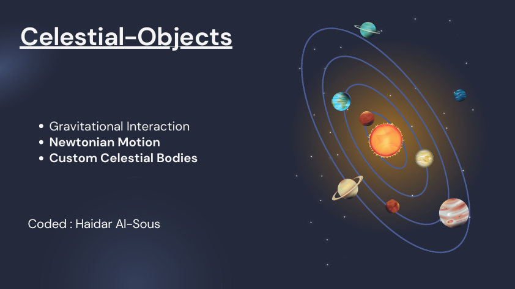
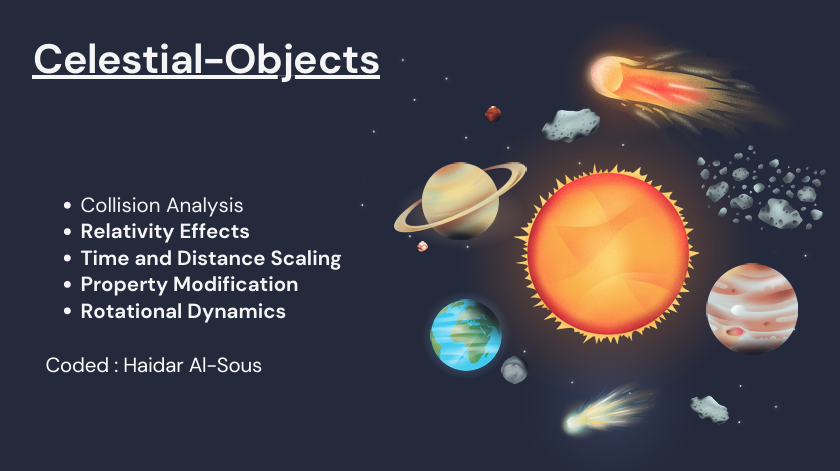
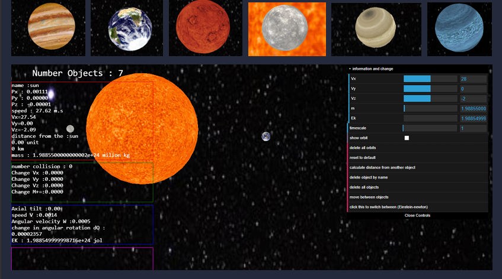

# Three.js Journey (Celestial Simulation Project)

## Overview

This project simulates the interactions and movements of celestial bodies based on physical laws. Users can add and modify celestial objects with specific properties and observe their behaviors.

## Basic Features


- **Gravitational Interaction**: Analyze mutual influences according to the law of universal gravitation.
- **Newtonian Motion**: Study movements using Newton's laws of motion.
- **Custom Celestial Bodies**: Users can add bodies with properties such as:
  - Name
  - Initial position
  - Initial velocity
  - Mass
  - Rotation speed
  - Diameter

## Advanced Features


- **Collision Analysis**: Study collisions between celestial bodies.
- **Relativity Effects**: Incorporate effects from relativity theory.
- **Time and Distance Scaling**: Visualize results with time and distance scaling, allowing acceleration and deceleration of time.
- **Property Modification**: Modify and delete properties during execution.
- **Rotational Dynamics**: Study body rotation and changes due to collisions.

- The sphere is geometrically drawn.


## User Interface


- **Interactive UI**: An interactive interface for displaying data and events, supporting mouse and keyboard interaction.


## Controls

- Right-click on a planet to reveal information about the planet and the distance between it and another planet
- **W**: Move forward
- **S**: Move backward
- **A**: Move left
- **D**: Move right

- **LEFT**: Rotate left
- **RIGHT**: Rotate right
- **UP**: Rotate up
- **DOWN**: Rotate down

## Technologies Used

- **Three.js**: For rendering 3D graphics.
- **JavaScript**: For implementing simulation logic.
- **CSS**: For styling the interface.


## Setup
Download [Node.js](https://nodejs.org/en/download/).
Run this followed commands:

``` bash
# Install dependencies (only the first time)
npm install

# Run the local server at localhost:8080
npm run dev

# Build for production in the dist/ directory
npm run build
```

# Project Concept

Study the movement of celestial bodies and their mutual effects.

## Input

- **Mass of the body**: \( m \)
- **Initial position of the body**: \( P_0 (x_0, y_0, z_0) \)
- **Initial velocity of the body**: \( V_0 (v_{x0}, v_{y0}, v_{z0}) \)

## Output

- **Position of the body at every moment \( t \)**: \( P(x, y, z) \)

## Calculating the Position

Based on the velocity calculation law, we have:

\[ 
V = P'(t) = \frac{dP}{dt} 
\]

Where:
- \( P \) is the position of the body
- \( V \) is the velocity of the body
- \( t \) is the time

- The change in position \( dP \) is given by:
  \[
  dP = V \cdot dt
  \]

  where \( dt \) is a very small time interval (e.g., 0.05s), which serves as the simulation's update rate.

### Velocity Calculation

- To find the velocity \( V \), we use:

  \[
  V = \int a \cdot dt \implies dV = a \cdot dt
  \]

- Acceleration \( a \) is calculated using Newton's second law:

  \[
  a = \frac{F}{m}
  \]

  where \( m \) is the mass of the body.

### Force Calculation

- The net force \( F \) is the sum of gravitational forces \( \sum F_{\text{g}} \) exerted by all other celestial bodies:

  \[
  \sum F_{\text{g}} = F_{\text{g1}} + F_{\text{g2}} + \ldots + F_{\text{gn}}
  \]

- Each gravitational force \( F_{\text{gi}} \) is calculated using Newton's law of universal gravitation:

  \[
  F_{\text{gi}} = G \frac{m \cdot m_i}{r^2}
  \]

  where:
  - \( G = 6.674 \times 10^{-11} \) (gravitational constant),
  - \( m \) is the mass of the body being studied,
  - \( m_i \) is the mass of the influencing body,
  - \( r \) is the distance between the two bodies.

### Force Components

- The force components in a 3D space are determined as follows:

  \[
  F_{\text{gix}} = G \frac{m \cdot m_i}{r^2} \cdot \cos(\alpha)
  \]

  \[
  F_{\text{giy}} = G \frac{m \cdot m_i}{r^2} \cdot \sin(\theta)
  \]

  \[
  F_{\text{giz}} = G \frac{m \cdot m_i}{r^2} \cdot \sin(\alpha)
  \]

  where:
  - \( \alpha \) is the angle between the x and z axes,
  - \( \theta \) is the angle between the y and z axes.

  \[
  \theta = \tan^{-1} \left(\frac{y_1 - y_2}{x_1 - x_2}\right)
  \]

  \[
  \alpha = \tan^{-1} \left(\frac{z_1 - z_2}{x_1 - x_2}\right)
  \]

### Acceleration and Velocity Update

- Calculate acceleration for each component:

  \[
  a_x = \frac{F_{\text{gx}}}{m}, \quad a_y = \frac{F_{\text{gy}}}{m}, \quad a_z = \frac{F_{\text{gz}}}{m}
  \]

- Update velocity:

  \[
  dV_x = a_x \cdot dt \implies V_x = V_x + dV_x
  \]

  \[
  dV_y = a_y \cdot dt \implies V_y = V_y + dV_y
  \]

  \[
  dV_z = a_z \cdot dt \implies V_z = V_z + dV_z
  \]

### Position Update

- Update position:

  \[
  dP_x = V_x \cdot dt \implies P_x = P_x + dP_x
  \]

  \[
  dP_y = V_y \cdot dt \implies P_y = P_y + dP_y
  \]

  \[
  dP_z = V_z \cdot dt \implies P_z = P_z + dP_z
  \]

## Velocity Calculation After Collision
- This module simulates the inelastic collision of two celestial bodies. During the collision, kinetic energy is partially transformed into internal energy, resulting in the formation of a new body or fragmentation.
### Conservation of Momentum

The principle of conservation of momentum states:

\[ 
P_{\text{before}} = P_{\text{after}}
\]

- Before and after the collision, we have:

\[
m_1 \cdot V_1 + m_2 \cdot V_2 = (m_1 + m_2) \cdot V'
\]

where:
- \( m_1, m_2 \) are the masses of the colliding bodies.
- \( V_1, V_2 \) are the velocities before the collision.
- \( V' \) is the velocity of the resulting body.

### Conservation of Kinetic Energy

During an inelastic collision, some kinetic energy is converted into internal or deformation energy \(\Delta E\):

\[
\frac{1}{2} m_1 V_1^2 + \frac{1}{2} m_2 V_2^2 = \frac{1}{2} (m_1 + m_2) V'^2 + \Delta E
\]

\(\Delta E\) is the energy converted from kinetic to internal energy.

- The expression for \(\Delta E\) is:

\[
\Delta E = \frac{1}{2} \frac{m_1 m_2}{m_1 + m_2} (V_1 - V_2)^2
\]

### Resulting Velocity

- The velocity of the resulting body \( V' \) is calculated as:

\[
V' = \frac{m_1 \cdot V_1 + m_2 \cdot V_2}{m_1 + m_2}
\]

## Relativity Calculations
- This section calculates mass, time, and distance according to Einstein's theory of relativity, accounting for changes relative to an observer as velocity increases.
### Relativistic Mass

- The relativistic mass \( M_r \) is calculated using:

  \[
  M_r = \frac{M_0}{\sqrt{1 - \frac{V^2}{C^2}}}
  \]

  where:
  - \( M_r \) is the relativistic mass.
  - \( M_0 \) is the rest mass.
  - \( V \) is the velocity relative to an observer.
  - \( C \) is the speed of light.

### Time Dilation

- Time dilation \(\Delta T\) is calculated as:

  \[
  \Delta T_0 = \frac{\Delta T_r}{\sqrt{1 - \frac{V^2}{C^2}}}
  \]

  where:
  - \(\Delta T_r\) is the time for an external observer.
  - \(\Delta T_0\) is the proper time.

### Relativistic Distance

- Using velocity relations:

  \[
  V = \frac{L_r}{\Delta T_r} \quad , \quad V = \frac{L_0}{\Delta T_0}
  \]

  this gives:

  \[
  L_r = L_0 \sqrt{1 - \frac{V^2}{C^2}}
  \]

  where:
  - \( L_r \) is the relativistic distance for an external observer.
  - \( L_0 \) is the proper length.
 
## Rotation Study of a Celestial Body

- This section examines the rotation of a celestial body around its axes, focusing on rotational velocity and kinetic energy.

### Rotational Velocity

- The rotational velocity \( V_r \) is given by:

  \[
  V_r = \sqrt{V_{rx}^2 + V_{ry}^2 + V_{rz}^2}
  \]

  where:
  - \( V_{rx}, V_{ry}, V_{rz} \) are the rotational velocities around the x, y, and z axes, respectively.

- Angular velocity \( \omega \) and angle \( \theta \) are calculated as:

  \[
  \omega = \frac{V_r}{r}
  \]

  \[
  \theta = \omega \cdot dt
  \]

### Kinetic Energy

- Kinetic energy \( E_k \) is proportional to the velocity:

  \[
  E_k = \frac{1}{2} m \cdot V_r^2
  \]

### Velocity Components from Interaction

- Velocities from friction or collision are:

  \[
  V_{rx} = \frac{m_1 \cdot V_{rx} + m_2 \cdot V_x}{m_1 + m_2}
  \]

  \[
  V_{ry} = \frac{m_1 \cdot V_{ry} + m_2 \cdot V_y}{m_1 + m_2}
  \]

  \[
  V_{rz} = \frac{m_1 \cdot V_{rz} + m_2 \cdot V_z}{m_1 + m_2}
  \]

### Axis of Rotation

- Determine the rotation axis angles:

  \[
  \text{angle}(\theta) = \cos^{-1}\left(\frac{V_{rx}}{\sqrt{V_{rx}^2 + V_{rz}^2}}\right)
  \]

  \[
  \text{angle}(A) = -\frac{\pi}{2} \cos^{-1}\left(\frac{\sqrt{V_{rx}^2 + V_{rz}^2}}{\sqrt{V_{rx}^2 + V_{ry}^2 + V_{rz}^2}}\right)
  \]

- The axis \( AB \) is defined as:

  - Point \( A \):

    \[
    A(P_x + 0.5 \cos(\theta) + \cos(A), P_y + 0.5 \sin(A), P_z + 0.5 \sin(\theta) \cdot \cos(A))
    \]

  - Point \( B \):

    \[
    B(P_x - 0.5 \cos(\theta) + \cos(A), P_y - 0.5 \sin(A), P_z - 0.5 \sin(\theta) \cdot \cos(A))
    \]
  
